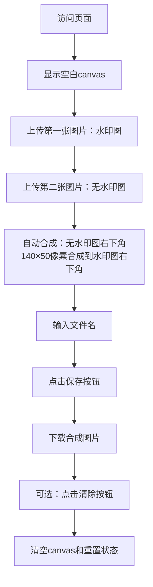

# 图片合成器产品需求文档

## 1. Product Overview

图片合成器是一个纯前端的单页面Web应用工具，用于合并两张图片并生成新的合成图片。

* 主要解决用户需要将无水印图片的特定区域合成到水印图片上的需求，适用于图片处理和水印添加场景。

* 目标是提供简单易用的图片合成功能，无需服务端支持，可直接在浏览器中完成操作。

## 2. Core Features

### 2.1 User Roles

本产品无需用户角色区分，所有访问者均可直接使用全部功能。

### 2.2 Feature Module

图片合成器包含以下主要页面：

1. **主页面**：标题显示、canvas画布、操作按钮区域。

### 2.3 Page Details

| Page Name | Module Name | Feature description                         |
| --------- | ----------- | ------------------------------------------- |
| 主页面       | 标题区域        | 显示"图片合成器"标题                                 |
| 主页面       | Canvas画布    | 默认1536×864尺寸，支持点击上传和拖拽上传图片，动态调整为图片尺寸并显示图片内容，固定3px透明边框，hover时显示蓝色边框，拖拽时显示蓝色虚线边框 |
| 主页面       | 文件操作区       | 包含文件名输入框（placeholder："文件名"）、保存按钮和清除按钮         |
| 主页面       | 图片上传功能      | 支持点击canvas打开文件选择器，支持拖拽图片到canvas，允许重复上传替换图片  |
| 主页面       | 图片合成逻辑      | 默认第一张图为水印图，第二张图为无水印图，将无水印图右下角140×50像素区域合成到水印图右下角  |
| 主页面       | 文件保存功能      | 根据文件名输入框内容下载合成后的图片              |
| 主页面       | 清除功能        | 清空canvas和重置所有状态                     |

## 3. Core Process

用户操作流程：

1. 用户访问页面，看到空白canvas
2. 用户点击canvas或拖拽图片上传第一张图片（水印图）
3. 用户上传第二张图片（无水印图）
4. 系统自动将无水印图的右下角140×50像素区域合成到水印图的右下角，显示在canvas里
5. 用户在文件名框输入文件名
6. 用户点击"保存"按钮下载合成图片
7. 用户可点击"清除"按钮清空canvas和重置状态

## 4. User Interface Design

### 4.1 Design Style

* 主色调：#2563eb（蓝色），辅助色：#64748b（灰色）

* 按钮样式：圆角矩形，悬停效果

* 字体：系统默认字体，标题18px，正文14px

* 布局风格：垂直居中布局，简洁明了

* 图标风格：简约线条图标

### 4.2 Page Design Overview

| Page Name | Module Name | UI Elements                          |
| --------- | ----------- | ------------------------------------ |
| 主页面       | 标题区域        | 居中显示，字体大小18px，颜色#1f2937              |
| 主页面       | Canvas画布    | 固定3px透明边框，默认背景#f9fafb，居中显示，hover时边框变为蓝色，拖拽时显示蓝色虚线边框 |
| 主页面       | 文件操作区       | 水平布局，文件名输入框宽度200px，保存按钮和清除按钮分别独立，保存按钮蓝色背景，清除按钮灰色背景 |
| 主页面       | 上传提示        | 拖拽时显示蓝色虚线边框和提示文字，避免边框粗细变化导致的抖动 |

### 4.3 Responsiveness

桌面优先设计，支持移动端自适应，考虑触摸交互优化。
